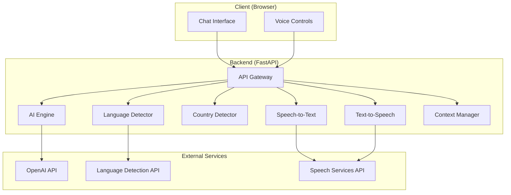

# Design Document

## Overview

DesiFriend AI is a full-stack conversational AI companion application designed to provide natural, friendly interactions in multiple Indian languages. The system architecture follows a client-server model with a React-based frontend and a FastAPI backend, integrating third-party services for AI conversation generation, language detection, and speech processing.

The application's core value proposition is its ability to understand and respond in 10 Indian languages (Hindi, Kannada, Tamil, Telugu, Malayalam, Bengali, Marathi, Gujarati, Punjabi, and English) including mixed-language inputs like Hinglish and Kanglish. It provides both text and voice interaction modes, with voice output featuring Indian-accented speech that adapts based on the user's geographic location.

The design prioritizes mobile-first user experience with a WhatsApp-inspired interface, fast response times (<3 seconds), and efficient data usage. The backend architecture is modular to support independent development and testing of components, with clear separation between AI processing, language detection, country detection, and speech services.

## Architecture

### System Architecture

The system follows a three-tier architecture:

1. **Presentation Layer**: React-based single-page application (SPA) providing the chat interface
2. **Application Layer**: FastAPI backend handling business logic, orchestration, and API endpoints
3. **Integration Layer**: Third-party services for AI, speech, and detection capabilities



### Technology Stack

**Frontend:**
- HTML5 for structure
- CSS3 for styling (mobile-first responsive design)
- Vanilla JavaScript for chat logic and API communication
- Web Audio API for voice playback
- MediaRecorder API for voice capture

**Backend:**
- Python 3.9+
- FastAPI for REST API framework
- Uvicorn as ASGI server
- Pydantic for data validation

**External Services:**
- OpenAI GPT-4 for conversational AI
- Google Cloud Translation API or similar for language detection
- Google Cloud Text-to-Speech or ElevenLabs for voice synthesis
- Google Cloud Speech-to-Text or Whisper API for voice recognition

**Deployment:**
- Railway or Render for hosting
- Environment-based configuration
- CORS enabled for cross-origin requests

### Communication Flow

1. **Text Message Flow:**
   - User types message → Frontend sends POST to `/api/chat`
   - Backend detects language and country
   - Backend generates AI response using conversation context
   - Backend generates audio for response
   - Backend returns JSON with text, audio URL, and metadata
   - Frontend displays message and provides audio playback option

2. **Voice Message Flow:**
   - User clicks microphone → Frontend captures audio
   - Frontend sends audio to `/api/voice-chat`
   - Backend converts speech to text
   - Backend follows text message flow
   - Frontend displays transcribed text and AI response

## Components and Interfaces

### Frontend Components

#### 1. Chat Interface (index.html + chat.js)

**Responsibilities:**
- Render message bubbles for user and AI
- Handle text input and send button
- Display detected language
- Show loading states
- Scroll management for message history

**Key Functions:**
```javascript
// Send text message to backend
async function sendMessage(text)

// Display user message in UI
function displayUserMessage(text)

// Display AI response in UI
function displayAIMessage(text, audioUrl, language)

// Show typing indicator
function showTypingIndicator()

// Auto-scroll to latest message
function scrollToBottom()
```

**State Management:**
- Message history array
- Current session ID
- Loading state
- Detected language

#### 2. Voice Interface (voice.js)

**Responsibilities:**
- Capture microphone audio
- Send audio to backend
- Play AI response audio
- Handle voice permissions

**Key Functions:**
```javascript
// Start recording from microphone
async function startRecording()

// Stop recording and send to backend
async function stopRecording()

// Play audio response
function playAudio(audioUrl)

// Request microphone permissions
async function requestMicrophonePermission()
```

**State Management:**
- Recording state
- Audio playback state
- Microphone permission status

#### 3. Styling (style.css)

**Responsibilities:**
- Mobile-first responsive layout
- WhatsApp-inspired visual design
- Message bubble styling
- Button and input styling
- Loading animations

**Key Design Patterns:**
- Flexbox for layout
- CSS Grid for message alignment
- Media queries for responsive breakpoints
- CSS variables for theming

### Backend Components

#### 1. API Gateway (app.py)

**Responsibilities:**
- Define REST API endpoints
- Handle CORS configuration
- Manage session state
- Orchestrate component interactions
- Error handling and logging

**Endpoints:**
```python
POST /api/chat
Request: {
    "message": str,
    "session_id": str (optional),
    "device_locale": str (optional),
    "ip_address": str (optional)
}
Response: {
    "response": str,
    "audio_url": str,
    "detected_language": str,
    "detected_country": str,
    "session_id": str
}

POST /api/voice-chat
Request: multipart/form-data with audio file
Response: Same as /api/chat with additional "transcribed_text" field

GET /api/health
Response: {"status": "healthy"}
```

**Session Management:**
- In-memory dictionary mapping session_id to conversation context
- Session timeout after 30 minutes of inactivity
- Automatic cleanup of expired sessions

#### 2. AI Engine (ai_engine.py)

**Responsibilities:**
- Generate conversational responses using OpenAI API
- Maintain casual, friendly tone
- Use conversation context for coherent responses
- Handle multi-language prompts

**Interface:**
```python
class AIEngine:
    def __init__(self, api_key: str):
        """Initialize with OpenAI API key"""
        
    def generate_response(
        self, 
        user_message: str, 
        conversation_history: List[Dict[str, str]],
        language: str
    ) -> str:
        """
        Generate AI response based on user message and context.
        
        Args:
            user_message: The user's input text
            conversation_history: List of previous messages
            language: Detected language for response generation
            
        Returns:
            AI-generated response text
        """
```

**Implementation Details:**
- Use GPT-4 or GPT-3.5-turbo model
- System prompt emphasizes casual, friendly tone
- System prompt includes language instruction
- Conversation history limited to last 10 messages to manage token usage
- Temperature set to 0.7 for natural variation

#### 3. Language Detector (language_detector.py)

**Responsibilities:**
- Detect language from text input
- Identify mixed languages (Hinglish, Kanglish, etc.)
- Return language code and confidence score

**Interface:**
```python
class LanguageDetector:
    def __init__(self):
        """Initialize language detection service"""
        
    def detect_language(self, text: str) -> Dict[str, Any]:
        """
        Detect the language of input text.
        
        Args:
            text: Input text to analyze
            
        Returns:
            {
                "language": str,  # e.g., "hi", "en", "ta"
                "language_name": str,  # e.g., "Hindi", "English"
                "is_mixed": bool,  # True for Hinglish, Kanglish, etc.
                "confidence": float  # 0.0 to 1.0
            }
        """
```

**Implementation Details:**
- Use Google Cloud Translation API or langdetect library
- For mixed language detection, analyze script mixing (Latin + Devanagari, etc.)
- Fallback to English if detection confidence < 0.5

#### 4. Country Detector (country_detector.py)

**Responsibilities:**
- Determine user's country from IP address or device locale
- Map country to appropriate voice accent

**Interface:**
```python
class CountryDetector:
    def __init__(self):
        """Initialize country detection service"""
        
    def detect_country(
        self, 
        ip_address: Optional[str] = None,
        device_locale: Optional[str] = None
    ) -> str:
        """
        Detect user's country.
        
        Args:
            ip_address: User's IP address
            device_locale: Device locale string (e.g., "en-IN")
            
        Returns:
            Country code: "IN", "US", "GB", or "OTHER"
        """
```

**Implementation Details:**
- First try device_locale parsing (e.g., "en-IN" → "IN")
- If unavailable, use IP geolocation service (ipapi.co or similar)
- Cache results per session to avoid repeated API calls
- Default to "IN" if detection fails

#### 5. Speech-to-Text Module (speech_to_text.py)

**Responsibilities:**
- Convert audio input to text
- Support all 10 languages
- Handle various audio formats

**Interface:**
```python
class SpeechToText:
    def __init__(self, api_key: str):
        """Initialize speech recognition service"""
        
    def transcribe(
        self, 
        audio_data: bytes,
        language_hint: Optional[str] = None
    ) -> str:
        """
        Convert speech audio to text.
        
        Args:
            audio_data: Audio file bytes
            language_hint: Optional language code to improve accuracy
            
        Returns:
            Transcribed text
        """
```

**Implementation Details:**
- Use Google Cloud Speech-to-Text or OpenAI Whisper
- Support WebM, MP3, WAV formats
- Auto-detect language if hint not provided
- Handle audio preprocessing (noise reduction, normalization)

#### 6. Text-to-Speech Module (text_to_speech.py)

**Responsibilities:**
- Convert text responses to audio
- Provide Indian-accented voices
- Support country-based accent adaptation
- Offer male and female voice options

**Interface:**
```python
class TextToSpeech:
    def __init__(self, api_key: str):
        """Initialize text-to-speech service"""
        
    def synthesize(
        self, 
        text: str,
        language: str,
        country: str,
        gender: str = "female"
    ) -> bytes:
        """
        Convert text to speech audio.
        
        Args:
            text: Text to convert
            language: Language code
            country: Country code for accent selection
            gender: "male" or "female"
            
        Returns:
            Audio data as bytes (MP3 format)
        """
```

**Implementation Details:**
- Use Google Cloud TTS with Indian English voices or ElevenLabs
- Voice mapping:
  - India: `en-IN-Wavenet-A` (female), `en-IN-Wavenet-B` (male)
  - USA: `en-US-Wavenet-C` (female), `en-US-Wavenet-D` (male)
  - UK: `en-GB-Wavenet-A` (female), `en-GB-Wavenet-B` (male)
- For Indian languages, use native voices (hi-IN, ta-IN, etc.)
- Cache generated audio files to reduce API costs
- Compress audio to optimize bandwidth

#### 7. Context Manager (context_manager.py)

**Responsibilities:**
- Store and retrieve conversation history per session
- Manage session lifecycle
- Clean up expired sessions

**Interface:**
```python
class ContextManager:
    def __init__(self):
        """Initialize context storage"""
        
    def create_session(self) -> str:
        """Create new session and return session_id"""
        
    def add_message(
        self, 
        session_id: str, 
        role: str, 
        content: str
    ):
        """Add message to conversation history"""
        
    def get_history(self, session_id: str) -> List[Dict[str, str]]:
        """Retrieve conversation history for session"""
        
    def clear_session(self, session_id: str):
        """Clear conversation history for session"""
        
    def cleanup_expired_sessions(self):
        """Remove sessions inactive for >30 minutes"""
```

**Implementation Details:**
- In-memory storage using dictionary
- Each session stores: messages list, last_activity timestamp
- Background task runs every 5 minutes to cleanup expired sessions
- Limit history to last 10 messages per session

## Data Models

### Message Model

```python
from pydantic import BaseModel
from typing import Optional, List
from datetime import datetime

class Message(BaseModel):
    role: str  # "user" or "assistant"
    content: str
    timestamp: datetime
    language: Optional[str] = None
```

### Chat Request Model

```python
class ChatRequest(BaseModel):
    message: str
    session_id: Optional[str] = None
    device_locale: Optional[str] = None
    ip_address: Optional[str] = None
```

### Chat Response Model

```python
class ChatResponse(BaseModel):
    response: str
    audio_url: str
    detected_language: str
    detected_country: str
    session_id: str
    transcribed_text: Optional[str] = None  # Only for voice input
```

### Session Model

```python
class Session(BaseModel):
    session_id: str
    messages: List[Message]
    last_activity: datetime
    detected_language: Optional[str] = None
    detected_country: Optional[str] = None
```

### Language Detection Result

```python
class LanguageDetectionResult(BaseModel):
    language: str  # ISO 639-1 code
    language_name: str  # Human-readable name
    is_mixed: bool
    confidence: float
```

### Voice Configuration

```python
class VoiceConfig(BaseModel):
    language: str
    country: str
    gender: str  # "male" or "female"
    voice_id: str  # Provider-specific voice identifier
```

## Correctness Properties

